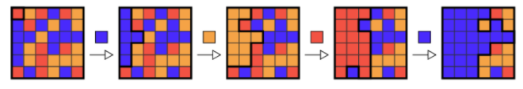

# Flood It Game

A Coding Challenge for everreal.co

## Technical Requirements

- Typescript
- Express.js API

## General Requirements

- n \* n table tiles where each tile is given one of m colors
- Each tile is connected to up to four adjacent tiles in the North, South, East, and West
- A tile is connected to the origin (the tile in the upper left corner)
- if it has the same color as the origin and there is a path to the origin consisting only of tiles of this color
- A player makes a move by choosing one of the m colors.
- all tiles that are connected to the origin are changed to the chosen color
- The game proceeds until all tiles of the board have the same color
- The goal of the game is to change all the tiles to the same color, preferably with the fewest number of moves possible.

## Game Requirements

- For each move, choose the color that will result in the largest number of tiles connected to the origin
- if there is a tie, break ties by choosing the color that has the lowest rank among the colors.

The following figure depicts a possible sequence of moves together with the chosen color on a 6 x 6 board initially filled up by 3 distinct colors.



Please implement the game and an automated player that determines the color choice for each move. We want to determine the amount of moves and the sequence of the colors chosen by the player over the course of a game. Please use unit tests to prove that your code is working properly!

If you can implement the simple greedy algorithm quickly, you might provide an improved solution using a modified A\* algorithm.

## Optional

Front-End - Optional point
Ideally the game should have an UI where the player can play by choosing every time a colour. At the end of the game, the player can compare his steps with the “AI player”.

The UI can be a very minimalistic table of maximum 10x10 and a colour picker and the display of history of moves at the end of the game, comparing the moves provided by the “AI player”

Depending on the time spent on the previous points, it is also fine to discuss the approach during the on-premise interview.

## My Approach

Using In-House created MERN framework that built by me (still work in progress).

#### Including :

- Express.js
- React.js
- MongoDB
- Mocha

## Logic

- Is creating 3 simple REST API endpoint (create new game , progress the game , solve the game)
- Game-engine.ts is class that act like brain of the application
  - Creating new game based on grid size that provided and solve it
  - Progress in game when user send color it will send back the reflected changes in the gird
  - Solve the game based on Recursive DFS Algorithm

## Running

### Clone Repository

```shell
git clone git@github.com:MohammadMahmoud/flood-it.git
```

### Install node modules

```shell
npm install
```

### Run MongoDB in docker (please install docker if you don't have)

```shell
npm run db:mongodb:start
```

### Run back-end and front-end

```shell
npm run dev
```

### To run back-end

```shell
npm run sever
```

### To run front-end

```shell
npm run client:start
```

### To run test

```shell
npm run test
```
